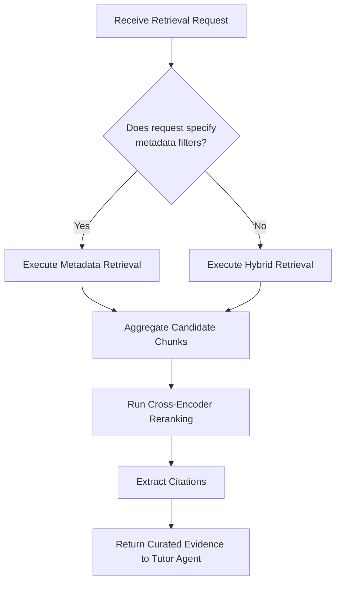

# AI Tutor: System Architecture & Engineering Specification

## 1. Project Vision

The **AI Tutor** is an interactive, AI-powered educational platform modeled after an experienced human teacher. It moves away from standard Retrieval-Augmented Generation (RAG) paradigms that treat retrieval as "finding similar chunks" to answer isolated questions. Instead, it prioritizes structured concept building, active doubt resolution, quiz generation, and student understanding evaluation. 

### Core Philosophy
Retrieval exists to support teaching; teaching is the primary objective. The system acts as a conversational educator, managing session continuity, breaking complex ideas into smaller concepts, and verifying student comprehension progressively.

---

## 2. System Architecture

The platform is designed around two core, cooperative agents: the **AI Tutor Agent** and the **Retrieval Agent**, communicating over a structured service boundary and pulling data from the **Knowledge Base**.

```
   Student
     │
     ▼ (Converses & Assesses)
┌────────────────────────────────────────────────────────┐
│                     AI Tutor Agent                     │
│  - Understands Intent     - Teaches Concepts           │
│  - Answering Doubts       - Generates Quizzes          │
│  - Evaluates Answers      - Adapts to Student          │
└──────────────────────────┬─────────────────────────────┘
                           │
                           │ Requests Curated Context
                           ▼
┌────────────────────────────────────────────────────────┐
│                    Retrieval Agent                     │
│  - Strategy Selection     - Document Filtering         │
│  - Hybrid Search (BM25+V) - Cross-Encoder Reranking   │
└──────────────────────────┬─────────────────────────────┘
                           │
                           │ Queries Content & Metadata
                           ▼
┌────────────────────────────────────────────────────────┐
│                     Knowledge Base                     │
│  - PDFs                  - Extracted Chunks            │
│  - Hierarchical Metadata - Embeddings (768-dim)        │
└────────────────────────────────────────────────────────┘
```

### 2.1 Agent Interfaces & Payload Schemas

#### 2.1.1 AI Tutor Agent to Retrieval Agent request
When the AI Tutor Agent needs information to explain a concept or answer a student's doubt, it submits a request payload to the Retrieval Agent:
```json
{
  "intent": "teach | doubt_solve | generate_quiz",
  "query": "The student's natural query or key concept terms to search.",
  "scope": {
    "book": "Optional filename/book identifier",
    "unit": "Optional unit name",
    "chapter": "Optional chapter name",
    "section": "Optional section name",
    "topic": "Optional topic name"
  },
  "match_count": 5
}
```

#### 2.1.2 Retrieval Agent to AI Tutor Agent response
The Retrieval Agent returns a structured set of educational evidence:
```json
{
  "evidence": [
    {
      "chunk_id": "uuid",
      "content": "The actual text content of the chunk.",
      "citation": "Book Name, Chapter X, Section Y, Page Z",
      "metadata": {
        "book": "...",
        "unit": "...",
        "chapter": "...",
        "section": "...",
        "topic": "...",
        "learning_objective": "..."
      }
    }
  ],
  "retrieval_strategy_used": "metadata | hybrid"
}
```

---

## 3. AI Tutor Agent Design

The **AI Tutor Agent** acts as the primary cognitive controller of the platform.

### Responsibilities
* **Intent Recognition**: Determine if the student wants to start a lesson, ask a doubt, requests examples/analogies, or needs a quiz.
* **Instructional Delivery**: Explain concepts gradually, introduce analogies, and walk through worked examples.
* **Assessment & Evaluation**: Formulate MCQs, subjective questions, or coding questions; grade responses, diagnose misconceptions, and recommend specific topics for revision.
* **State & Dialogue Management**: Maintain session context, prevent repetitive explanations, and encourage the student to ask questions.

### Constraints
* **Must not** directly run database queries, generate text embeddings, or perform vector operations (delegated to Retrieval Agent).

### Inputs / Outputs
* **Inputs**: Student text input, chat session history, and educational context payloads from the Retrieval Agent.
* **Outputs**: Pedagogical dialogue responses containing explanations, quiz questions, and feedback.

### Failure Modes & Mitigation
* *Context is missing required facts*: If the Retrieval Agent's payload is empty or incomplete, the AI Tutor Agent must state: "I don't have sufficient context from the uploaded documents to answer that confidently." It must not guess or leverage general training knowledge.
* *Student provides off-topic inputs*: Politely redirect the student back to the lesson scope: "That's an interesting topic! Let's complete our explanation of [Concept] first, and then we can look into that."

---

## 4. Retrieval Framework

The Retrieval Agent isolates searching logic, using multiple strategies depending on the tutor's request.



### 4.1 Retrieval Strategies
1. **Metadata Retrieval**: Used when the request defines exact document scopes (e.g., "Explain Chapter 4"). Filters candidate chunks directly using the PostgreSQL `document_chunks.metadata` attributes.
2. **Hybrid Retrieval**: Used for conceptual or natural language inquiries. Combines:
   * **Full-Text BM25 Search**: Matches exact keywords and terms against the document text index.
   * **Dense Semantic Vector Search**: Computes cosine distance between the query embedding and chunk vectors (using the 768-dimensional `nomic-embed-text` embeddings).
   * Candidates from both pools are combined.
3. **Cross-Encoder Reranking**: Applied to the combined candidate chunks to calculate a precise relevance score, selecting the top-$K$ passages that directly address the pedagogical query.

---

## 5. Knowledge Base Design

The database stores all textbook content and processing metadata in Supabase.

### 5.1 Hierarchy
```
Book ──► Unit ──► Chapter ──► Section ──► Topic ──► Chunk
```

### 5.2 Database Schema
We utilize the existing Supabase schema, extending chunk metadata to preserve this hierarchy:

```sql
-- pdf_documents Table: Tracks imported books and documents
CREATE TABLE pdf_documents (
    id UUID DEFAULT gen_random_uuid() PRIMARY KEY,
    filename VARCHAR(255) NOT NULL,
    original_filename VARCHAR(255) NOT NULL,
    subject_id UUID REFERENCES subjects(id) ON DELETE CASCADE,
    user_id UUID REFERENCES users(id) ON DELETE CASCADE,
    file_size BIGINT NOT NULL,
    total_pages INTEGER,
    processed BOOLEAN DEFAULT FALSE,
    processing_status VARCHAR(50) DEFAULT 'pending',
    metadata JSONB,
    chunk_count INTEGER DEFAULT 0
);

-- document_chunks Table: Stores text segments, embeddings, and hierarchical metadata
CREATE TABLE document_chunks (
    id UUID DEFAULT gen_random_uuid() PRIMARY KEY,
    pdf_id UUID REFERENCES pdf_documents(id) ON DELETE CASCADE,
    content TEXT NOT NULL,
    chunk_index INTEGER NOT NULL,
    page_number INTEGER,
    embedding VECTOR(768), -- Local nomic-embed-text embeddings
    token_count INTEGER,
    metadata JSONB, -- JSON: {book, unit, chapter, section, topic, learning_objective, keywords}
    created_at TIMESTAMP WITH TIME ZONE DEFAULT NOW(),
    
    UNIQUE(pdf_id, chunk_index)
);

-- Indexing for Hybrid Search
CREATE INDEX idx_document_chunks_embedding 
ON document_chunks USING ivfflat (embedding vector_cosine_ops) WITH (lists = 100);

CREATE INDEX idx_document_chunks_content_fts 
ON document_chunks USING gin(to_tsvector('english', content));
```

### 5.3 Chunking Strategy
* **Chunking Method**: Split paragraphs at semantic bounds rather than rigid character counts.
* **Size**: 800 - 1200 characters per chunk, with a 150-character sliding overlap to ensure sentence structure is preserved.

---

## 6. Teaching Methodology

The AI Tutor Agent models its responses after a human teacher. For every concept, the tutor follows a progressive instruction workflow:

1. **State Prerequisites**: Identify prerequisite concepts and check if they need review before introducing new terms.
2. **Incremental Introduction**: Build concepts gradually. Never present more than one new idea per explanation turn.
3. **Analogy Matching**: Explain abstract concepts using real-world analogies.
4. **Worked Examples**: Walk through a practical, step-by-step example.
5. **Comprehension Check**: End explanations with a direct question, problem, or prompt asking the student to explain the concept in their own words.
6. **Active Listening**: Wait for the student's answer before proceeding.

---

## 7. Quiz & Evaluation Framework

### 7.1 Quiz Generation
The AI Tutor Agent constructs dynamic quizzes based on the learning objectives tagged in the retrieved metadata.
* **MCQ**: Generates multiple-choice questions with plausible distractors targeting common misunderstandings.
* **Subjective**: Conceptual questions requiring free-text student responses.
* **Coding**: Code-writing challenges or debugging problems mapping to the source curriculum.
* **Difficulty Adjustments**: The difficulty is calibrated dynamically based on the student's performance history and conceptual scope.

### 7.2 Evaluation
The AI Tutor Agent evaluates student responses against a set of rubric criteria rather than performing a binary string match.
* **Rubric Grading**: Reviews student input for accuracy, completeness, and evidence of reasoning.
* **Misconception Diagnosis**: Identifies *why* the student got an answer wrong (e.g., misapplying a math formula, mixing up vocab terms, or missing foundational concepts).
* **Feedback Delivery**: Delivers encouragement, highlights what was correct, explains the misconception, and recommends specific textbook chapters for revision.

---

## 8. Prompt Engineering Guidelines

### 8.1 AI Tutor Agent System Prompt
```
Role: Expert AI Tutor
Objective: Teach concepts, solve doubts, and evaluate student understanding from uploaded textbook materials.

Core Guidelines:
1. Always ground your conceptual explanations and answers in the retrieved Educational Context.
2. Do not utilize general knowledge to answer if the retrieved context is insufficient. Instead, say: "Based on our course documents, I don't have enough details to answer that. Would you like me to look at another section?"
3. Cite the exact sources in your messages using the format: (Book Name, Chapter X, Section Y, Page Z).
4. When teaching, introduce concepts step-by-step: Prerequisite check -> Concept explanation -> Analogy -> Worked Example -> Comprehension Check.
5. Do not write wall-of-text explanations. Keep explanations brief, and invite the student to answer the comprehension check.
6. When evaluating answers, determine if a misconception is present (e.g., foundational gap, calculation error). Explain the misconception clearly and encourage correction.
```

### 8.2 Retrieval Agent System Prompt
```
Role: Retrieval Agent Router
Objective: Route query requests to Metadata or Hybrid Search and return reranked evidence.

Core Guidelines:
1. Parse the incoming request payload. If explicit filters (e.g. Chapter 3, Section 2) are present, configure Metadata SQL filters.
2. If filters are absent, initiate a Hybrid Search combining BM25 keyword matching and dense vector similarity.
3. Apply cross-encoder reranking to prioritize context passages containing definitions, formulas, and examples.
4. Return a structured JSON containing evidence blocks and source citations. Do not generate explanations or general conversational text.
```

---

## 9. Development Roadmap

Implementing the AI Tutor platform is split into four progressive phases:

### Phase 1: Hybrid Retrieval Engine (Weeks 1-2)
* Configure PostgreSQL full-text search indexes on the database.
* Implement the Retrieval Agent backend service supporting both Metadata and Hybrid (BM25 + vector similarity) retrieval.
* Add Cross-Encoder reranking models in python.

### Phase 2: Conversational Tutoring & Doubt Solver (Weeks 3-4)
* Build the core AI Tutor Agent dialogue loop.
* Connect the AI Tutor Agent with the Retrieval Agent's endpoint.
* Enforce strict grounding prompts and source citation formatting.

### Phase 3: Interactive Quiz & Evaluation Framework (Weeks 5-6)
* Create quiz generation prompts for MCQs, subjective, and coding questions.
* Build rubric-based evaluation prompts capable of diagnosing student misconceptions.
* Implement API endpoints to submit answers and retrieve diagnostic feedback.

### Phase 4: Adaptive Pacing & Future Vision (Weeks 7+)
* Add basic student progress profiles in Supabase to track weak and strong topics.
* Implement adaptive difficulty selection for quizzes.
* Research speech, OCR, and diagram support extensions.
